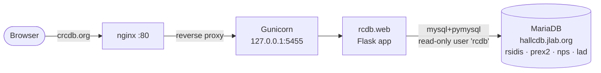

# crcdb.org deployment

Deploy + configuration files for serving the **Hall C Run Conditions
Database** (`rcdb` web app) from **crcdb.org**.

The app is server-rendered Flask (`rcdb.web`), run under Gunicorn and
reverse-proxied by nginx. All run-condition data is read live from the Hall C
**MariaDB** server at `hallcdb.jlab.org`.

## Architecture



- nginx listens on **:80** and reverse-proxies every request to Gunicorn on
  **127.0.0.1:5455**. Terminate TLS either at nginx (see `nginx-crcdb-https`)
  or at an upstream proxy/load balancer.
- The rcdb app connects to MariaDB over the SQLAlchemy `mysql+pymysql` driver
  as the read-only `rcdb` user (no password), so there are no secrets to
  manage.

## Files in this repo

| File | Purpose |
| --- | --- |
| `test_index.html` | Static placeholder page for Step 1. |
| `nginx-crcdb-test` | nginx site for test (static pages only) |
| `nginx-crcdb` | nginx site with reverse-proxies to the rcdb Gunicorn app on :80 |
| `wsgi_crcdb.py` | WSGI entry point; configures `rcdb.web.app` |
| `crcdb.service` | systemd unit running Gunicorn (gthread worker) for the rcdb app. |
| `nginx-systemd-override.conf` | Drop-in so nginx auto-restarts on failure (resilience). |

> The `firebird` user has **no sudo**; the privileged steps below (apt, `/opt`,
> systemd, nginx) must be run by a sudo-capable account.
>
> There are **no secrets** to configure: the `rcdb` MariaDB user is read-only
> with no password, and the app has no login, so nothing sensitive is stored.

---

# Step 1 — static test page at crcdb.org

Goal: confirm DNS → nginx routing works before introducing the WSGI app. The
repo lives at `/home/firebird/hallcdb/crcdb-deploy`.

```bash
# 1. Create the document root and install the test page
sudo mkdir -p /var/www/crcdb
sudo chown -R firebird:firebird /var/www/crcdb
sudo chmod 755 /var/www/crcdb
cp /home/firebird/hallcdb/crcdb-deploy/test_index.html /var/www/crcdb/index.html

# 2. Install the nginx site (static-only config) and enable it
sudo cp /home/firebird/hallcdb/crcdb-deploy/nginx-crcdb-test /etc/nginx/sites-available/crcdb
sudo ln -sf /etc/nginx/sites-available/crcdb /etc/nginx/sites-enabled/crcdb

# 3. Test and reload nginx
sudo nginx -t
sudo systemctl reload nginx
```

**Verify:**

```bash
# Local origin check by Host header
curl -s -H 'Host: crcdb.org' http://127.0.0.1/ | head

# Public
curl -sI http://crcdb.org/
```

Then open <https://crcdb.org> in a browser — you should see the "crcdb.org"
placeholder page.

---

# Step 2 — rcdb WSGI application

Sets up a Python venv, installs the local `rcdb` package and the MariaDB
driver, runs it under Gunicorn via systemd, and switches nginx from the static
page to a reverse proxy.

### 2a. Python environment + rcdb install

```bash
sudo apt update
sudo apt install -y python3-venv python3-dev build-essential

sudo mkdir -p /opt/crcdb
sudo chown firebird:firebird /opt/crcdb

python3 -m venv /opt/crcdb/venv
source /opt/crcdb/venv/bin/activate
pip install --upgrade pip wheel

# Install the rcdb package from the hallcdb submodule (editable so updates
# to the submodule are picked up on service restart). Pulls Flask, SQLAlchemy.
pip install -e /home/firebird/hallcdb/rcdb/python

# MariaDB/MySQL driver (pymysql) + cryptography (for newer auth plugins),
# and the WSGI server.
pip install pymysql cryptography gunicorn

deactivate
```

### 2b. Install the WSGI entry + log dir

```bash
cp /home/firebird/hallcdb/crcdb-deploy/wsgi_crcdb.py /opt/crcdb/wsgi_crcdb.py

sudo mkdir -p /var/log/crcdb
sudo chown firebird:firebird /var/log/crcdb
```

### 2c. Smoke-test Gunicorn by hand (before systemd)

```bash
source /opt/crcdb/venv/bin/activate
cd /opt/crcdb
PYTHONPATH=/opt/crcdb gunicorn --bind 127.0.0.1:5455 \
    --worker-class gthread --workers 1 --threads 4 --timeout 120 \
    wsgi_crcdb:application --log-level info
# In another shell:  curl -sI http://127.0.0.1:5455/      → expect HTTP 200
# Ctrl-C to stop, then:  deactivate
```

> **About `WORKER TIMEOUT ... (no URI read)`** — if you run gunicorn with the
> *default* sync worker and poke it from a browser, you'll see periodic
> `[CRITICAL] WORKER TIMEOUT` with an `Error handling request (no URI read)`
> traceback. This is **not** an app error: the page renders fine. A sync worker
> blocks in `recv()` on an *idle* keep-alive / browser-preconnect socket — no
> request ever arrives ("no URI read") — and the master reaps it at the
> timeout. The `gthread` worker class used above and in `crcdb.service` fixes
> this: idle connections are parked on a thread while the heartbeat keeps
> ticking. Behind nginx it's mostly moot anyway, since nginx closes the
> upstream connection after each request.

### 2d. systemd service

```bash
sudo cp /home/firebird/hallcdb/crcdb-deploy/crcdb.service /etc/systemd/system/crcdb.service
sudo systemd-analyze verify crcdb.service
sudo systemctl daemon-reload
sudo systemctl enable --now crcdb
sudo systemctl status crcdb
# Logs:  sudo journalctl -u crcdb -e   |   tail -f /var/log/crcdb/error.log
```

### 2e. Switch nginx to the proxy config

```bash
sudo cp /home/firebird/hallcdb/crcdb-deploy/nginx-crcdb /etc/nginx/sites-available/crcdb
sudo nginx -t
sudo systemctl reload nginx
```

**Verify:**

```bash
curl -s -H 'Host: crcdb.org' http://127.0.0.1/ | head     # rcdb HTML now
curl -sI http://crcdb.org/                                # public
```

Open <https://crcdb.org> — the rcdb run table should render, with a database
selector (rsidis / prex2 / nps / lad) in the navbar.

### Databases

All data is read live from the Hall C **MariaDB** server `hallcdb.jlab.org`
over the `mysql+pymysql` driver, as the read-only `rcdb` user (no password).
The web UI selector exposes these databases (defined in `AVAILABLE_DATABASES`
in `wsgi_crcdb.py`):

| Selector | Database | Notes |
| --- | --- | --- |
| `rsidis` | `rsidis` | R-SIDIS — **default** |
| `prex2`  | `prex2`  | PREX2/CREX |
| `nps`    | `nps`    | NPS production |
| `lad`    | `lad`    | LAD |
| `xem2`    | `xem2`    | XEM2 |
| `pionct`    | `pionct`    | pionCT |

Only **v2-schema** databases are supported (the bundled rcdb library is
v2-only). To change the list, default, host, or user, edit
`AVAILABLE_DATABASES` / `DEFAULT_DATABASE` / `DB_HOST` / `DB_USER` in
`wsgi_crcdb.py`, re-copy it to `/opt/crcdb/`, then `sudo systemctl restart crcdb`.

---

## Resilience (recommended)

nginx by default does not auto-restart if a reload/restart fails. Install the
drop-in so a transient failure doesn't take the site down:

```bash
sudo mkdir -p /etc/systemd/system/nginx.service.d
sudo cp /home/firebird/hallcdb/crcdb-deploy/nginx-systemd-override.conf \
        /etc/systemd/system/nginx.service.d/override.conf
sudo systemctl daemon-reload
```

## Operations cheatsheet

```bash
sudo systemctl status crcdb           # app status
sudo systemctl restart crcdb          # after changing wsgi_crcdb.py or updating rcdb
sudo journalctl -u crcdb -e           # app logs (systemd)
tail -f /var/log/crcdb/error.log      # gunicorn error log
tail -f /var/log/nginx/crcdb.error.log

# Update rcdb code (submodule) then restart:
cd /home/firebird/hallcdb && git submodule update --remote rcdb
sudo systemctl restart crcdb
```

## Troubleshooting

### App returns 500 / won't start

```bash
sudo journalctl -u crcdb -e
tail -n 50 /var/log/crcdb/error.log
```

- **`OperationalError` / `Can't connect to MySQL server`** — the box cannot
  reach the MariaDB server, or a database name is wrong. Check connectivity:

  ```bash
  nc -vz hallcdb.jlab.org 3306                    # is the DB port reachable?
  source /opt/crcdb/venv/bin/activate
  python -c "import pymysql; \
      pymysql.connect(host='hallcdb.jlab.org', user='rcdb').close(); print('OK')"
  ```

  If the port is filtered, the database server is only reachable from within
  its own network — run crcdb on a host that has access, or arrange a tunnel.

### nginx 502 / 504

Gunicorn isn't answering on `127.0.0.1:5455`. Confirm the service is up
(`sudo systemctl status crcdb`) and listening (`ss -ltnp | grep 5455`).

## Rollback

```bash
# Disable crcdb entirely:
sudo rm -f /etc/nginx/sites-enabled/crcdb
sudo systemctl reload nginx
sudo systemctl disable --now crcdb
```
